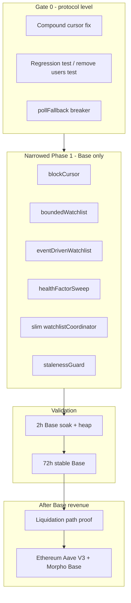

# Liquidation + Arbitrage Bot — Implementation Plan (Revised)

## Strategic constraints (non-negotiable)

1. **Focus chain: Base Aave V3** — production target is `CHAIN=base` ([`chains.ts`](src/config/chains.ts) already has Base config; pool + [`aavePoolAbi`](src/protocols/aaveV3.ts) in repo). Ethereum and Morpho come **after** Base is live.
2. **Survival over scope** — Narrowed Phase 1 spike (6 modules + wiring), not the full original Phase 1 metrics/alerts/multi-chain bundle in one PR.
3. **Revenue first** — Prove at least one real **liquidation** path on Base before Phase 2 arb diagnostics.
4. **2026 robustness** — Full event set (incl. `Withdraw`), gap replay backoff + reorg guardrails, cold-start subgraph + RPC fallback, multicall batch proven on **Base** RPC.

**Sequencing for revenue velocity:** Base MVP → 72h stable → liquidation proof → Phase 1b polish → Phase 2 arb → **Phase 3: Ethereum Aave V3 + Morpho Base** (no features dropped, only reordered).

---

## Immediate next actions

### Gate 0 (today / tomorrow) — same files, same PR

Protocol-level; not chain-specific.

| Step | Files |
|------|--------|
| Compound `id_gt` cursor fix | [`src/protocols/aaveV3.ts`](src/protocols/aaveV3.ts) |
| Compound-id regression test; **remove** `users` fallback test | [`test/unit/aaveV3.test.ts`](test/unit/aaveV3.test.ts) |
| Shared `RescanCircuitBreaker` on degraded path | [`src/monitors/hybridDetectionPipeline.ts`](src/monitors/hybridDetectionPipeline.ts), [`src/index.ts`](src/index.ts) |
| Heap snapshot run (can repeat at validation) | operational / [`src/utils/heapSnapshotHarness.ts`](src/utils/heapSnapshotHarness.ts) |

Gate: `npm test` + `npm run typecheck` green.

### Narrowed Phase 1 spike — Base only

New modules (explicit file split):

| File | Role |
|------|------|
| [`src/utils/blockCursor.ts`](src/utils/blockCursor.ts) | `lastProcessedBlock` per chain; optional `REDIS_URL`, in-memory fallback |
| [`src/monitors/boundedWatchlist.ts`](src/monitors/boundedWatchlist.ts) | 50k cap, stale eviction |
| [`src/monitors/eventDrivenWatchlist.ts`](src/monitors/eventDrivenWatchlist.ts) | WS + gap replay on **Base pool** + `aavePoolAbi` |
| [`src/monitors/healthFactorSweep.ts`](src/monitors/healthFactorSweep.ts) | Multicall HF sweep; batch from Base RPC probe |
| [`src/monitors/watchlistCoordinator.ts`](src/monitors/watchlistCoordinator.ts) | **Slim** — cold start, sweep, `BorrowerSnapshotProvider` for pipeline |
| [`src/monitors/stalenessGuard.ts`](src/monitors/stalenessGuard.ts) | 60s critical pause |

Wiring:

- [`src/config/chains.ts`](src/config/chains.ts) — Base remains primary; no Ethereum work in this spike
- [`src/index.ts`](src/index.ts) — `USE_EVENT_WATCHLIST=true`, `CHAIN=base`, start/stop coordinator + event watchlist in `buildPipelineBot`

### Validation gate (end of Phase 1 spike)

**2h run on Base** with:

```env
CHAIN=base
USE_EVENT_WATCHLIST=true
ENABLE_HEAP_SNAPSHOTS=true
```

Pass criteria:

- RSS stable (heap comparison T+5 vs T+35 if snapshots taken)
- `watchlist_circuit_breaker_open` = 0 (or no `watchlist_circuit_breaker_open` logs)
- Gap replay works on restart (log `watchlist_gap_replay` / chunk completion)
- Zero `borrower_watchlist_rescan_failed` storms

Then **72h continuous stable run on Base** before any market expansion.

---

## What we defer (not dropped)

After **72h stable Base** + liquidation path proof:

- Full watchlist Prometheus suite + [`prometheus/alerts/bot_critical.yml`](prometheus/alerts/bot_critical.yml) (Phase 1b)
- Phase 2 arb precheck histograms
- **Phase 3:** Ethereum Aave V3 + Morpho Base (per original master plan table)
- Phase 4 Grafana

---

## Current state (verified in repo)

- [`arbQueue.stop()`](src/index.ts) — wired; no change
- [`RescanCircuitBreaker`](src/monitors/rescanCircuitBreaker.ts) — block/interval rescans only; **gap** on [`pollFallback`](src/monitors/hybridDetectionPipeline.ts)
- [`aaveV3.ts`](src/protocols/aaveV3.ts) — `users` fallback still present; compound cursor tests can mask production `id` shape
- **Base** — default in [`.env.example`](.env.example) (`CHAIN=base`); [`getChainConfig("base")`](src/config/chains.ts) + resolved pool in [`index.ts`](src/index.ts)
- Event watchlist / multicall sweep — not started



---

## Gate 0 — Prerequisites (unchanged)

Must be green before Phase 1 spike.

### Issue 1 — Compound cursor ([`src/protocols/aaveV3.ts`](src/protocols/aaveV3.ts))

- Export `ZERO_CURSOR_ID`; positions-only `id_gt` pagination
- `lastId = p.id` (raw compound id), not extracted wallet address
- Remove `borrowerQueryModeByClient`, `borrowerQueryUsers`, and all `users` fallback paths

### Issue 1b — Tests ([`test/unit/aaveV3.test.ts`](test/unit/aaveV3.test.ts))

- **Add** compound-id cursor regression (`capturedVars[1].lastId === COMPOUND_ID`)
- **Remove** `falls back to legacy users` test
- Fixtures: compound `id` only (no `account: { id }`-only rows)

### Issue 2 — Circuit breaker on `pollFallback`

- One shared [`RescanCircuitBreaker`](src/monitors/rescanCircuitBreaker.ts) in [`buildPipelineBot`](src/index.ts)
- Wrap [`HybridDetectionPipeline.pollFallback`](src/monitors/hybridDetectionPipeline.ts) body; do not rethrow when open

### Issue 3 — `arbQueue.stop()`

- No change (already in shutdown callback)

### Issue 4 — Heap snapshot diff

- Run after Gate 0; repeat during 2h validation gate if needed

---

## Narrowed Phase 1 — MVP event watchlist (Base Aave V3 only)

**Target:** `CHAIN=base`, `USE_EVENT_WATCHLIST=true`. Subgraph **off the per-block hot path**; used **once** at cold start (Base subgraph is stable).

### Wiring ([`chains.ts`](src/config/chains.ts) + [`index.ts`](src/index.ts))

- Single active chain: **Base** (do not enable event watchlist on optimism/arbitrum in this spike)
- After `startupGuard` resolves Base pool address:
  - `watchlistCoordinator.start()` → cold-start subgraph seed → `eventDrivenWatchlist.start()`
  - `hybridDetection` provider = coordinator (implements `pollBorrowers` via multicall sweep)
- Shutdown: `eventDrivenWatchlist.stop()`, coordinator stop, existing `arbQueue.stop()`

**Env:**

- `USE_EVENT_WATCHLIST=true`
- `REDIS_URL` optional (in-memory cursor OK; warn if unset)
- `MULTICALL_BATCH_SIZE` — set after Base RPC probe only
- `REORG_SAFE_DEPTH` — default **10** on Base (~2s blocks)
- `GAP_REPLAY_CHUNK_DELAY_MS`, `COLD_START_LOOKBACK_BLOCKS` — tune for Base (~50k blocks ≈ ~28h)

### Cold start (Base subgraph primary)

1. **Once at startup:** `protocol.listBorrowerAddresses()` via fixed compound cursor → seed [`boundedWatchlist`](src/monitors/boundedWatchlist.ts)
2. **Fallback** if subgraph fails/empty: RPC `getLogs` over `COLD_START_LOOKBACK_BLOCKS` with same event set + gap-replay guardrails
3. If both fail: empty watchlist + **critical** log; rely on live WS

### Event watchlist (Base pool + `aavePoolAbi`)

[`eventDrivenWatchlist.ts`](src/monitors/eventDrivenWatchlist.ts) on resolved Base pool:

- `Borrow`, `Repay`, `Supply`, **`Withdraw`**, `LiquidationCall`
- Extract `user` / `onBehalfOf` / liquidation `user`
- [`blockCursor.ts`](src/utils/blockCursor.ts): persist `bot:lastProcessedBlock:base`

### Gap replay guardrails

- 2000-block chunks; shrink on oversized response
- Exponential backoff per chunk (250ms → 2s, max 5 retries)
- Reorg-safe writes: `blockNumber <= head - REORG_SAFE_DEPTH`
- Single-flight `getLogs`; optional inter-chunk delay

### Health-factor sweep (Base RPC)

[`healthFactorSweep.ts`](src/monitors/healthFactorSweep.ts):

1. **Probe** production Base `RPC_URL` / `WS_RPC_URL_PRIMARY` with batch sizes `[100, 250, 500, 1000]`
2. Pick largest batch with zero errors and p95 within poll budget (`POLL_INTERVAL_MS` ~400)
3. Base gas is cheap — **optional tighter tiers in spike** if probe headroom allows:
   - High signal: `HF < 1.15` every block
   - Low tier: `HF >= 1.15` every 100 blocks (include if trivial after probe; else Phase 1b)

Filters: `hf < 1e18`, `debtUsd > minLiquidationDebtUsd`.

### Slim watchlist coordinator

[`watchlistCoordinator.ts`](src/monitors/watchlistCoordinator.ts) — minimal orchestration only:

- Owns `boundedWatchlist`, `eventDrivenWatchlist`, `healthFactorSweep`, `stalenessGuard.record()` on successful updates
- `pollBorrowers(chain)` → sweep → `BorrowerSnapshot[]` for [`HybridDetectionPipeline`](src/monitors/hybridDetectionPipeline.ts)
- `refreshBorrowers` / `refreshWatchlistBorrowers` delegate to existing [`AaveSnapshotProvider`](src/monitors/aaveSnapshotProvider.ts) RPC paths for targeted refreshes

### Staleness guard

- `fresh` &lt; 60s, `critical` ≥ 60s
- [`PipelineOrchestrator`](src/orchestrator/pipelineOrchestrator.ts): `critical` → log + return (no liquidation eval)
- MVP logging: structured `watchlist_stale_critical` (full Prom gauges in Phase 1b)

---

## Revenue gate — one real liquidation path on Base (before Phase 2)

**Blocks:** Phase 2 arb metrics until cleared.

On **Base**, `SIMULATION_MODE` → gated live:

1. Sweep detects `HF < 1.0`, `debtUsd > MIN_LIQUIDATION_DEBT_USD`
2. `buildLiquidationExecutionRequest` + resolved Base pool/receiver
3. Profitability / dust gate pass at realistic Base gas
4. Dry-run preview OK; one live tx with deployment safety gate **or** documented would-execute with evidence

Success log: `liquidation_path_validated` (tx hash or dry-run receipt + candidate proof).

---

## Phase 1b — After 72h stable Base

- Full Prometheus watchlist metrics + alert rules
- Redis recommended for production cursor
- Any tiering polish not shipped in spike

---

## Phase 2 — Arbitrage diagnostic (deferred)

After liquidation proof on Base:

- `arb_precheck_fail_total{reason}` + `arb_quote_latency_seconds`
- One diagnostic session; no route changes until dominant failure reason known

---

## Phase 3 — Market expansion (after Base is printing)

**Gate:** 72h stable Base run + liquidation path validated (catching or executing real liquidations).

Per original master plan — **no features dropped:**

| Protocol | Chain | Notes |
|----------|-------|--------|
| Aave V3 | Ethereum mainnet | Add `ethereum` to `SupportedChain` + config; reuse watchlist modules |
| Morpho | Base | Different liquidation mechanic; config + tests per protocol |

Same filters: `debtUsd > $500`, HF tiers as deployed on Base.

---

## Phase 4 — Grafana

After Phase 1b alerts exist and Base+expansion stable.

---

## Files touched (summary)

**Gate 0:** `aaveV3.ts`, `aaveV3.test.ts`, `hybridDetectionPipeline.ts`, `index.ts`

**Phase 1 (Base spike):** `blockCursor.ts`, `boundedWatchlist.ts`, `eventDrivenWatchlist.ts`, `healthFactorSweep.ts`, `watchlistCoordinator.ts`, `stalenessGuard.ts`, `aaveSnapshotProvider.ts` (thin delegate), `pipelineOrchestrator.ts`, `index.ts`, `chains.ts` (Base-only flags)

**Deferred:** `prometheus/alerts/*`, full `bot.ts` watchlist metrics, `arbitrageScanner.ts` precheck breakdown, Ethereum/Morpho config

**Do not touch:** arbitrage pool addresses in scanner/adapter, dedupe prune timers, `SafeTransactionExecutor`, pipeline dead-letter core, `nonceManager`, `profitabilityEngine`, `productionReadiness`, `hazardPrediction`

---

## Test commands

```bash
npm test
npm run typecheck
```

Add: `test/integration/multicallBatchProbe.integration.test.ts` (skip without `RPC_URL`; document chosen batch for Base).
